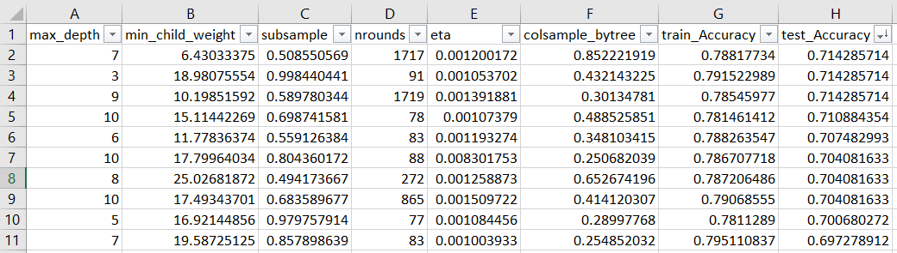
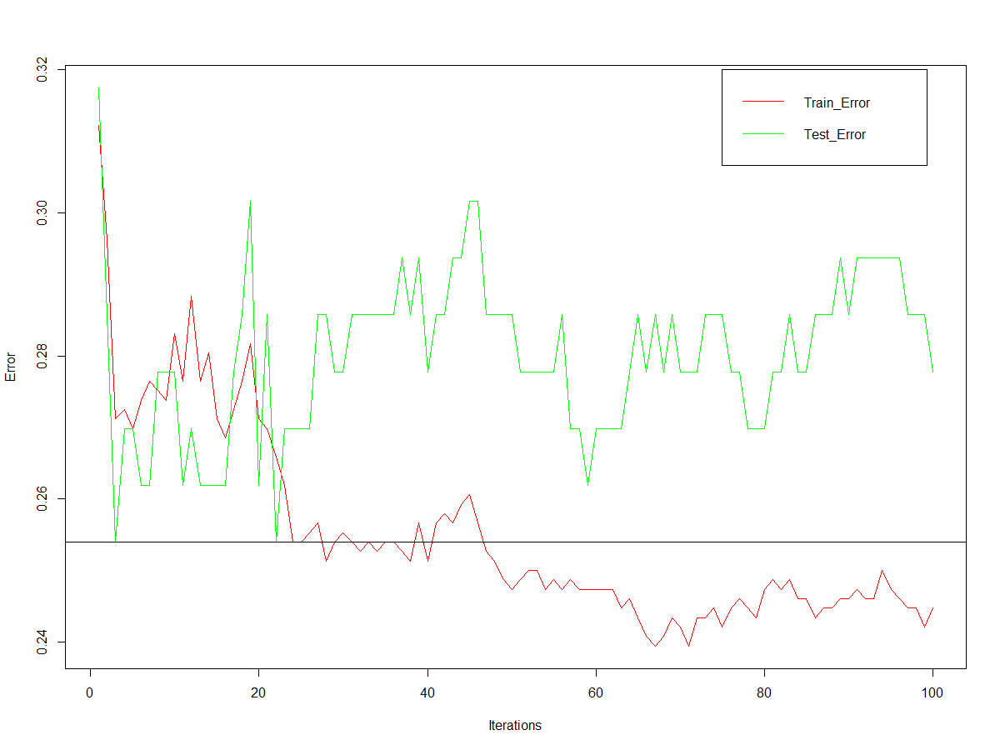
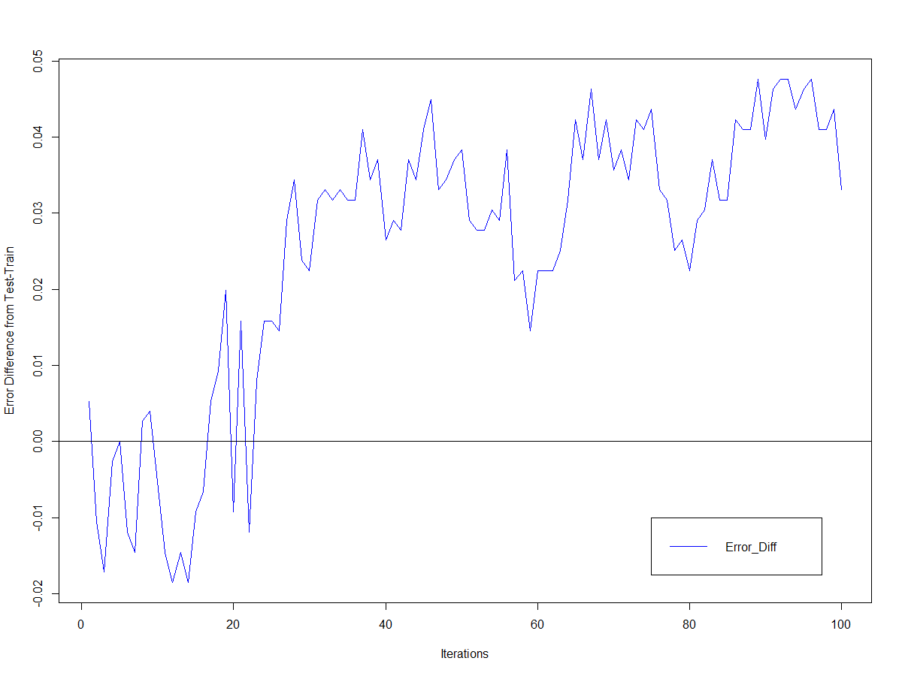
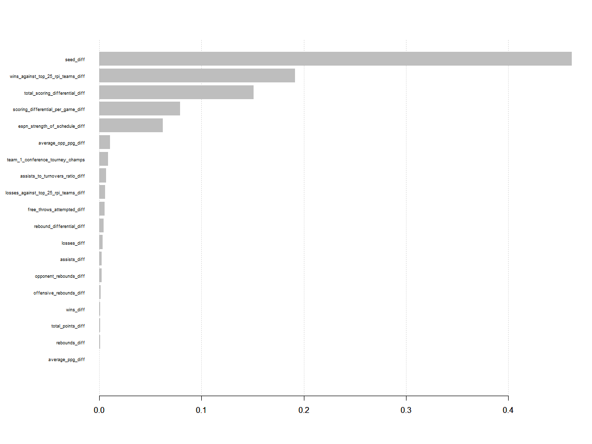
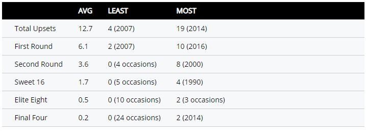
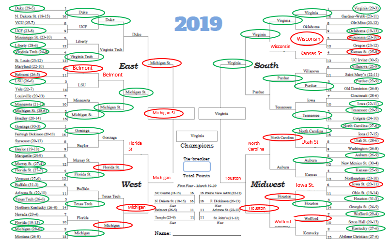

# NCAA-March-Madness-Modeling

## Background

Sports, especially basketball, are a passion of mine and thousands of people get excited every year for March Madness. I am no exception and I strive to create the best bracket along with everyone else. In the fall of 2019 the idea of using data analysis and modeling to try and predict the winners of March Madness games was given to me at The Great Lakes Analytics Conference held in Stevens Point, WI. I reached out to a speaker at the conference and they provided a dataset for past March Madness tournaments. I used this dataset to create a model using XGBoost to try and predict future games.
#
#
#

## Overview

My training data consisted of 756 rows of team data for every tournament team from 2013-2018. Then, I used 2019 as my test dataset. I utilized RStudio primarily for this project along with excel. The overall goal of this project was to try and predict games better than always picking the better seed, since this is a strategy someone might do who is unfamiliar with March Madness. Therefore, being able to predict upsets is crucial. Upsets are when a worse seed beats a better seed (i.e. a 12 seed beats a 5 seed). Even if a 9 seed beats an 8 seed (boring, yes I know), I still consider it an upset.

## Step 1: Create a Optimized Hyperparameter Search

For those not familiar with modeling this step probably won't matter for you and to keep it brief I just tweaked a few things to make my future models more accurate. What I actually did was use the MLR package in RStudio to utilize Bayesian Optimization for the hyperparamters: "max_depth", "min_child_weight", "subsample", "nrounds", "eta", and "colsample_bytree". I performed this method in a loop where it found the best parameters for 10 scenarios. This was also replicated for 3 fold, 5 fold, and 10 fold cross validation. I ended up using a 10 fold cross validation set of hyperparameters pictured below.

## Step 2: Test with 2019 Tournament

I then used the results from step 1 to create a model that I used to test on the 2019 games. This included only the actual matchups that occurred in the tournament. Meaning that if I chose Belmont to advance to the second round to play LSU I used the actual matchups for each round which would be LSU vs. Maryland. For this step I adjusted "nrounds" even more which represent the number of iterations/trees the model performs. I wanted to find the number for nrounds that would have the least amount of error within the test sets of the validations. Below is a graph showing where this might occur.

Here we are most interested in the green line being as low as possible while also having the red ling being close to the green line at that point. The horizontal black line represents that lowest value. It occurs in two places, when nrounds = 3 and 22. I ended up setting nrounds = 22.

I mentioned making sure that the red and the green lines are close to eachother. This graph shows the difference in the errors between the two when you subtract the train error from the test error. Ideally, we want this to be as close to zero as possible, and at iteration 22 it is close to zero.

The testing results from making predictions on all actual games gave an accuracy of 74.6% for the tournament year 2019. Looking at the important variables shows some things that should be expected, but also some insight on what might be important for picking winners in games. The difference in seed between teams is the most important (not surprising), but then wins against top 25 rpi teams is second. A few others appears to be more significant than others as well.

## Step 3: Hypothetical Matchups and Making predictions

I wanted to try and replicate how I might make predictions with new tournament as much as possible. When doing this I realized that my model may not be picking enough upsets. So I decided to pick a certain number of upsets each round based on historically what has happened in past tournaments.

I got an idea from this image which shows the average number of upsets that have occurred in tournaments from 1985 to about 2016. Now looking at just the data I have, I decided to choose 9 upsets to occur in round 1 (average from 2013-2018 was 8.5), 4 upsets in round 2, 2 upsets in round 3, and 2 in round 4. The remaining rounds I let the model predict the winners. This image along with the previous one have information that I would recommend everyone take into consideration when making March Madness predictions.

Here is my final predicted bracket! Green circles represent where I correctly chose that team to advance to the next round. Red circles show where I chose the wrong team to advance. Then, I also have the incorrect teams written in red that I wrongfully predicted to be in that round. Overall, I had an accuracy of 74.6% which is eerily the same as when I was predicting only actual matchups. I chose 9 upsets to occur in the first round and 8 of them were correct. However, only 11 out of my 17 predicted upsets ended up being correct.

## Conclusion

In the end I am happy with my first attempt at this. If only I had chosen Virginia to win in the end! Some possible changes I would like to make would be to include other data fields that might make my predictions better and possibly include data from more tournaments. I hope you enjoyed this project and that it will benefit your future tournament predictions!
